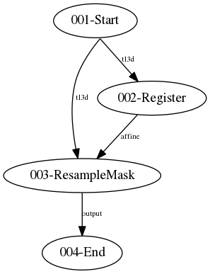

# pirec2
## A make-like pipeline system for neuroimaging analysis

### Motivation

pirec2 aims to provide a framework for expressing and running neuroimaging
analysis pipelines that enables code re-use and rapid development.

### Installation

Installation can be done by checking the code out from Github and using pip:

    git clone https://github.com/jstutters/pirec2
    cd pirec2
    pip install .

### Getting started

First we need to define some processing tasks. Tasks should be designed to
perform a single task that can be re-used. A task must have a fixed number of
inputs and outputs. pirec2 represents analysis tasks as class that inherit
from pirec2.Task. Create a file called tasks.py as containing two tasks which
performs registration using reg_aladin and resampling using reg_resample:

```python
from pirec2 import Task
from subprocess import run

class Register(Task):
    """Register floating to reference using reg_aladin."""

    def __init__(self, floating, reference):
        super().__init__()
        self.floating = self.add_input(floating, filename='floating.nii.gz')
        self.reference = self.add_input(reference, filename='reference.nii.gz')
        self.output = self.add_output(filename='output.nii.gz')
        self.affine = self.add_output(filename='affine.txt')

    def process(self):
        cmd = [
            'reg_aladin',
            '-ref', 'reference.nii.gz',
            '-flo', 'floating.nii.gz',
            '-aff', 'affine.txt',
            '-res', 'output.nii.gz',
        ]
        run(cmd)


class ResampleMask(Task):
    """Resample floating into the space of reference using a transform."""

    def __init__(self, floating, reference, transform):
        super().__init__()
        self.floating = self.add_input(floating, filename='floating.nii.gz')
        self.reference = self.add_input(reference, filename='reference.nii.gz')
        self.transform = self.add_input(transform, filename='transform.txt')
        self.output = self.add_output(filename='output.nii.gz')

    def process(self):
        cmd = [
            'reg_resample',
            '-ref', 'reference.nii.gz',
            '-flo', 'floating.nii.gz',
            '-trans', 'transform.txt',
            '-inter', '0',
            '-res', 'output.nii.gz',
        ]
        run(cmd)
```

Some things to note:
    
 * ``super().__init__()`` must be called in the class `__init__` method.
 * The ``filename`` argument of ``self.add_input`` will be used to name files when they are copied into your task's working directory.
 * The ``filename`` argument of ``self.add_output`` is used to track files created by your pipeline which will be used in subsequent stages or as results.  You do not need to create outputs for all files created.
 * The ``process`` function will be executed when the task is run.  The process might involve calling external programs but could also be pure python.  When ``process`` is called the working directory will contain files named according to the inputs defined in ``__init__`` (in this case: floating.nii.gz and reference.nii.gz)

pirec2 requires that task definitions be importable so you may wish to define
them in a package and install this to the environment you will be using for
your analysis.

Once you have defined your tasks you can compose them into a pipeline.
Pipelines should be described using a python file that contains definitions
of a ``Start`` class inheriting from ``pirec2.InputTask``, an ``End`` class
inheriting from ``pirec2.Task`` that gathers your results and a
``definition`` function which instantiates and connects tasks and returns the
an instance of ``End``. Create a file called reg_pipeline.py as shown below:

```python
import tasks
from pirec2 import InputTask, Task


class Start(InputTask):
    def __init__(self, ref, mask_img, mask):
        super().__init__()
        self.ref = self.add_output(filename=ref)
        self.mask_img = self.add_output(filename=mask_img)
        self.mask = self.add_output(filename=mask)


class End(Task):
    def __init__(self, registered_mask):
        super().__init__()
        self.registered_mask = self.add_input(registered_mask, filename='registered.nii.gz')
        self.result = self.add_output(filename='output.nii.gz')

    def process(self):
        shutil.copy('registered.nii.gz', 'output.nii.gz')


def definition():
    start = Start(ref='t13d.nii.gz', mask_img='pd.nii.gz', mask='pd_mask.nii.gz')
    register_mask_image = tasks.Register(
        floating=start.mask_img,
        reference=start.ref
    )
    resample_mask = tasks.ResampleMask(
        floating=start.mask,
        reference=start.ref,
        transform=register_mask_image.affine
    )
    end = End(registered_mask=resample_mask.output)
    return end
```

The ``Start`` class has only outputs and is responsible from bringing files
in from the rest of the filesystem to the pipeline working directory. The
``End`` class gathers the results of your pipeline and may do things like
write report files or insert database records. The five instructions in the
definition function do the following:

 1. Instantiate the ``Start`` class and set the input filenames.
 2. Instantiate a ``Register`` task and connect it to the ``ref`` and ``mask_img`` outputs from ``start``.
 3. Instantiate a ``ResampleMask`` task and connect it to the ``ref`` and ``mask`` outputs from ``start`` and the ``affine`` output from the ``Register`` task.
 4. Instantiate the ``End`` task and connect it's input to the output of ``ResampleMask``.
 5. Return the instance of ``End``

 To run the pipeline change to the directory containing ``tasks.py``, ``reg_pipeline.py`` and the input images and run:

    pirec2 reg_pipeline

You should see some output from pirec2 indicating which tasks are running and
some program output. After the pipeline has completed the newly created
``tmp`` directory will contain the working directories for each task. Now try
running pirec2 again with the -c argument (which tells pirec2 to skip
checksum verification of existing files):

    pirec2 -c reg_pipeline
    
The command output should now indicate that all tasks are up-to-date. Next
try deleting the output of the resampling task and re-running the pipeline:

    rm tmp/003-ResampleMask/output.nii.gz
    pirec2 -c reg_pipeline

This time the first two tasks should be marked as up-to-date but the third
task will execute again.

### Graphing

pirec2 can create a visualisation of your pipeline by specifying the -g
switch. An example graph is shown below:


